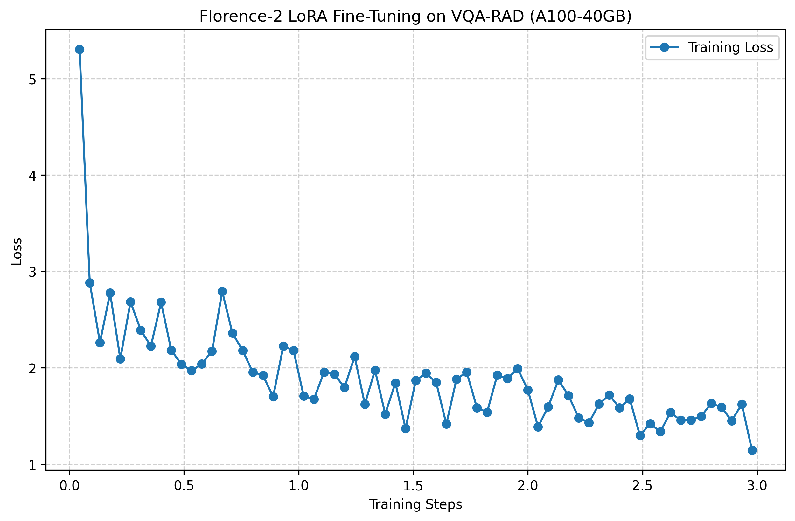

# Generative AI Radiology VLM

An end-to-end Medical ML Engineering project demonstrating how to fine-tune and deploy Microsoft's **Florence-2 Vision-Language Model** to answer free-form textual questions about radiology images. 

Unlike standard image classification, this system relies on Generative AI to understand both natural language questions and medical imagery, outputting textual diagnoses and observations.

## Architecture & Technology Stack
- **Base Model**: `microsoft/Florence-2-base` (Generative Vision-Language Model)
- **Fine-Tuning Method**: Parameter-Efficient Fine-Tuning (PEFT) using LoRA (Low-Rank Adaptation)
- **Dataset**: `flaviagiammarino/vqa-rad` (Radiology Visual Question Answering)
- **Infrastructure**: Modal (A100-40GB GPU for training, dynamic allocation for serving)
- **Deployment**: FastAPI Serverless Endpoint

## Project Structure
- `train_vlm.py`: Modal serverless script to download the dataset, inject LoRA adapters, train on an A100 GPU for 3 epochs, and save the weights to a persistent cloud volume.
- `serve_vlm.py`: The deployment API. Merges the trained LoRA adapters back into the base Florence-2 model at boot and exposes a FastAPI endpoint to accept an image and a text question.
- `plot_metrics.py`: Utility to parse Hugging Face training logs and plot learning curves.
- `test_vqa.py`: A local script to test the live API with an X-Ray image and a custom prompt.
- `upload_to_hf.py`: Utility to push the fine-tuned LoRA weights to the Hugging Face Hub.

## Setup & Installation
1. Clone this repository.
2. Install the necessary dependencies:
   ```bash
   pip install modal requests matplotlib huggingface_hub
   ```
3. Authenticate with Modal:
   ```bash
   modal setup
   ```

## 1. Training
To spin up an A100 GPU in the cloud and kick off the LoRA fine-tuning process:
```bash
modal run train_vlm.py
```
*(The weights will be automatically saved to a Modal Volume named `vlm-model-vol`)*

### Training Results
The model was trained for 3 epochs, showing rapid convergence on the medical vocabulary and anatomical features:



## 2. Serving the API
To deploy the fine-tuned model as a highly-available serverless web API:
```bash
modal deploy serve_vlm.py
```

## 3. Testing the Endpoint
Once deployed, Modal will provide you with a live URL. You can send a chest X-Ray and a medical question to your VLM using:
```bash
python test_vqa.py <YOUR_MODAL_ENDPOINT_URL> path/to/sample_xray.jpg "What abnormality is present?"
```
